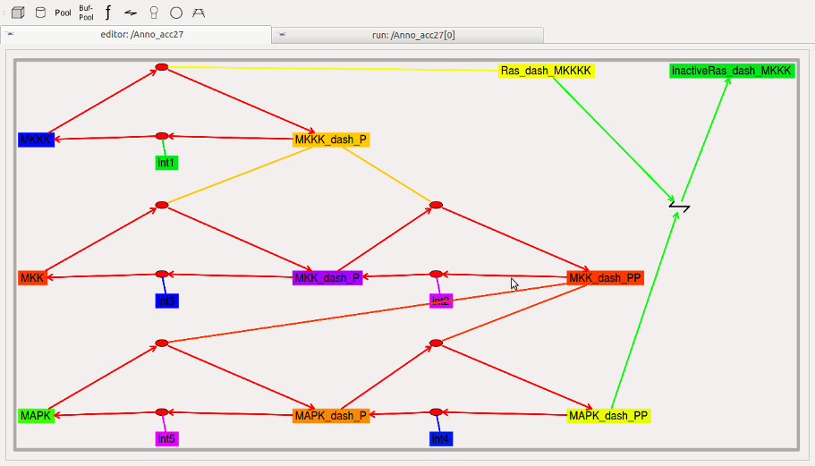
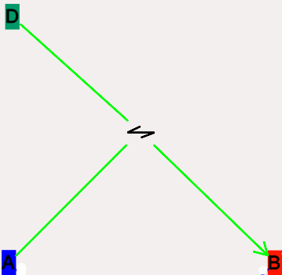
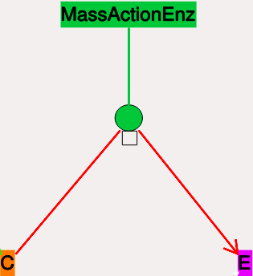
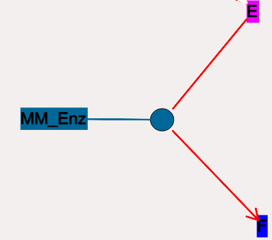
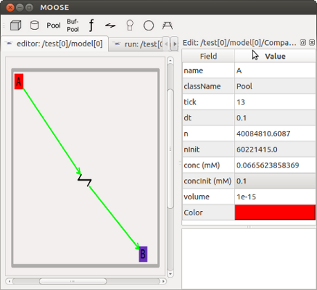
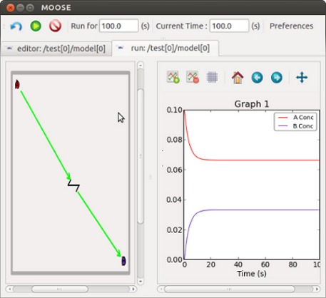

*   [Introduction](#introduction)

*   [**TODO** What are chemical kinetic models?](#todo-what-are-chemical-kinetic-models)
    *   [Levels of model](#levels-of-model)
    *   [Numerical methods](#numerical-methods)
*   [Using Kinetikit 12](#using-kinetikit-12)

        *   [Overview](#overview)
    *   [Model layout and icons](#model-layout-and-icons)

                *   [Compartment](#compartment)
        *   [Pool](#pool)
        *   [Buffered pools](#buffered-pools)
        *   [Reaction](#reaction)
        *   [Mass-action enzymes](#mass-action-enzymes)
        *   [Michaelis-Menten Enzymes](#michaelis-menten-enzymes)
        *   [Function](#function)
    *   [Model operations](#model-operations)
    *   [Model Building](#model-building)

Kinetikit 12 - An interface for chemical kinetic models
=======================================================

Kinetikit 12 is a graphical interface for doing chemical kinetic modeling in MOOSE. It is derived in part from Kinetikit, which was the graphical interface used in GENESIS for similar models. Kinetikit, also known as kkit, was at version 11 with GENESIS. Here we start with Kinetikit 12.

What are chemical kinetic models?
---------------------------------

Much of neuronal computation occurs through chemical signaling. For example, many forms of synaptic plasticity begin with calcium influx into the synapse, followed by calcium binding to calmodulin, and then calmodulin activation of numerous enzymes. These events can be represented in chemical terms:

> 4 Ca2+ + CaM &lt;===&gt; Ca4.CaM

Such chemical equations can be modeled through standard Ordinary Differential Equations, if we ignore space:

> d[Ca]/dt = −4Kf ∗ [Ca]4 ∗ [CaM] + 4Kb ∗ [Ca4.CaM]
> d[CaM]/dt = −Kf ∗ [Ca]4 ∗ [CaM] + Kb ∗ [Ca4.CaM]
> d[Ca4.CaM]/dt = Kf ∗ [Ca]4 ∗ [CaM] − Kb ∗ [Ca4.CaM]

MOOSE models these chemical systems. This help document describes how to do such modelling using the graphical interface, Kinetikit 12.

Levels of model
---------------

Chemical kinetic models can be simple well-stirred (or point) models, or they could have multiple interacting compartments, or they could include space explicitly using reaction-diffusion. In addition such models could be solved either deterministically, or using a stochastic formulation. At present Kinetikit handles compartmental models but does not compute diffusion within the compartments, though MOOSE itself can do this at the script level. Kkit12 will do deterministic as well as stochastic chemical calculations.

Numerical methods
-----------------

*   **Deterministic**: Adaptive timestep 5th order Runge-Kutta-Fehlberg from the GSL (GNU Scientific Library).
*   **Stochastic**: Optimized Gillespie Stochastic Systems Algorithm, custom implementation.

Overview
--------

*   Load models using **`File -> Load model`**. A reaction schematic for the chemical system appears in the  **`Editor view`** tab.
*   View parameters in **`Editor view`** tab by clicking on icons, and looking at entries in **`Properties`** table to the right.
*   Edit parameters by changing their values in the **`Properties`** table.
*   From Run View, Pools can be plotted by clicking on their icons and dragging the icons onto the plot Window. Presently only concentration is plottable.
*   Run models using **`Run`** button.
*   Select numerical method using options under **`Preferences`** button in simulation control.
*   Save plots using the icons at the bottom of the **`Plot Window`**.

Most of these operations are detailed in other sections, and are shared with other aspects of the MOOSE simulation interface. Here we focus on the Kinetikit specific items.

Model layout and icons
----------------------

When you are in the **`Model View`** tab you will see a collection of icons, arrows, and grey boxes surrounding these. This is a schematic of the reaction scheme being modeled. You can view and change parameters, and change the layout of the model.

Resizing the model layout and icons:

*   **Zoom**: Comma and period keys. Alternatively, the mouse scroll wheel or vertical scroll line on the track pad will cause the display to zoom in and out.
*   **Pan**: The arrow keys move the display left, right, up, and down.
*   **Entire Model View**: Pressing the **`a`** key will fit the entire model into the entire field of view.
*   **Resize Icons**: Angle bracket keys, that is, **`<`** and **`>`** or **`+`** and **`-`**. This resizes the icons while leaving their positions on the screen layout more or less the same.
*   **Original Model View**: Presing the **`A`** key (capital `A`) will revert to the original model view including the original icon scaling.

Compartment
-----------

The _compartment_ in moose is usually a contiguous domain in which a certain set of chemical reactions and molecular species occur. The definition is very closely related to that of a cell-biological compartment. Examples include the extracellular space, the cell membrane, the cytosol, and the nucleus. Compartments can be nested, but of course you cannot put a bigger compartment into a smaller one.

*   **Icon**: Grey boundary around a set of reactions.
*   **Moving Compartments**: Click and drag on the boundary.
*   **Resizing Compartment boundary**: Happens automatically when contents are repositioned, so that the boundary just contains contents.
*   **Compartment editable parameters**:

    *   **`name`**: The name of the compartment.
    *   **`size`**: This is the volume, surface area or length of the compartment, depending on its type.
*   **Compartment fixed parameters**:

    *   **`numDimensions`**: This specifies whether the compartment is a volume, a 2-D surface, or if it is just being represented as a length.

Pool
----

This is the set of molecules of a given species within a compartment. Different chemical states of the same molecule are in different pools.

*   **Icon**:  Colored rectangle with pool name in it.
*   **Moving pools**: Click and drag.
*   **Pool editable parameters**:

    *   **`name`**: Name of the pool
    *   **`n`**: Number of molecules in the pool
    *   **`nInit`**: Initial number of molecules in the pool. `n` gets set to this value when the `reinit` operation is done.
    *   **`conc`**: Concentration of the molecules in the pool.

        > conc = n * unit_scale_factor / (NA * vol)
    *   **`concInit`**: Initial concentration of the molecules in the pool.

        > concInit = nInit * unit_scale_factor / (NA * vol)
`conc` is set to this value when the `reinit` operation is done.
*   **Pool fixed parameters**

    *   **`size`**: Derived from the compartment that holds the pool. Specifies volume, surface area or length of the holding compartment.

Buffered pools
--------------

Some pools are set to a fixed `n`, that is number of molecules, and therefore a fixed concentration, throughout a simulation. These are buffered pools.

*   **Icon**:  Colored rectangle with pool name in it.
*   **Moving Buffered pools**: Click and drag.
*   **Buffered Pool editable parameters**

    *   **`name`**: Name of the pool
    *   **`nInit`**: Fixed number of molecules in the pool. `n` gets set to this value throughout the run.
    *   **`concInit`**: Fixed concentration of the molecules in the pool.

        > concInit = nInit * unit_scale_factor / (NA * vol)
`conc` is set to this value throughout the run.
*   **Pool fixed parameters**:

    *   **`n`**: Number of molecules in the pool. Derived from `nInit`.
    *   **`conc`**: Concentration of molecules in the pool. Derived from `concInit`.
    *   **`size`**: Derived from the compartment that holds the pool. Specifies volume, surface area or length of the holding compartment.

Reaction
--------

These are conversion reactions between sets of pools. They are reversible, but you can set either of the rates to zero to get irreversibility. In the illustration below, **`D`** and **`A`** are substrates, and **`B`** is the product of the reaction. This is indicated by the direction of the green arrow.

*   **Icon**:  Reversible reaction arrow.
*   **Moving Reactions**: Click and drag.
*   **Reaction editable parameters**:

    *   **`name`**: Name of reaction
    *   **`K``f`**: Forward rate of reaction, in `concentration/time` units. This is the normal way to express and manipulate the reaction rate.
    *   **`k``f`**: Forward rate of reaction, in `number/time` units. This is used internally for computations, but is volume-dependent and should not be used to manipulate the reaction rate unless you really know what you are doing.
    *   **`K``b`**: Backward rate of reaction, in `concentration/time` units. This is the normal way to express and manipulate the reaction rate.
    *   **`k``b`**: Backward rate of reaction, in `number/time` units. This is used internally for computations, but is volume-dependent and should not be used to manipulate the reaction rate unless you really know what you are doing.
*   **Reaction fixed parameters**:

    *   **`numProducts`**: Number of product molecules.
    *   **`numSubstrates`**: Number of substrates molecules.

Mass-action enzymes
-------------------

These are enzymes that model the chemical equations

> E + S &lt;===&gt; E.S —&gt; E + P

Note that the second reaction is irreversible. Note also that mass-action enzymes include a pool to represent the **`E.S`** (enzyme-substrate) complex. In the example below, the enzyme pool is named **`MassActionEnz`**, the substrate is **`C`**, and the product is **`E`**. The direction of the enzyme reaction is indicated by the red arrows.

*   **Icon**:  Colored ellipse atop a small square. The ellipse represents the enzyme. The small square represents **`E.S`**, the enzyme-substrate complex. The ellipse icon has the same color as the enzyme pool **`E`**. It is connected to the enzyme pool **`E`** with a straight line of the same color.

    The ellipse icon sits on a continuous, typically curved arrow in red, from the substrate to the product.

    A given enzyme pool can have any number of enzyme activities, since the same enzyme might catalyze many reactions.

*   **Moving Enzymes**: Click and drag on the ellipse.
*   **Enzyme editable parameters**

    *   **`name`**: Name of enzyme.
    *   **`K``m`**: Michaelis-Menten value for enzyme, in `concentration` units.
    *   **`k``cat`**: Production rate of enzyme, in `1/time` units. Equal to `k``3`, the rate of the second, irreversible reaction.
    *   **`k``1`**: Forward rate of the **`E+S`** reaction, in number and `1/time` units. This is what is used in the internal calculations.
    *   **`k``2`**: Backward rate of the **`E+S`** reaction, in `1/time` units. Used in internal calculations.
    *   **`k``3`**: Forward rate of the **`E.S —> E + P`** reaction, in `1/time` units. Equivalent to `k``cat`. Used in internal calculations.
    *   **`ratio`**: This is equal to `k``2``/k``3`. Needed to define the internal rates in terms of `K``m` and `k``cat`. I usually use a value of 4.
*   **Enzyme-substrate-complex editable parameters**: These are identical to those of any other pool.

    *   **`name`**: Name of the **`E.S`** complex. Defaults to **`<enzymeName>_cplx`**.
    *   **`n`**: Number of molecules in the pool
    *   **`nInit`**: Initial number of molecules in the complex. `n` gets set to this value when the `reinit` operation is done.
    *   **`conc`**: Concentration of the molecules in the pool.

        > conc = n * unit_scale_factor / (NA * vol)
    *   **`concInit`**: Initial concentration of the molecules in the pool.

        > concInit = nInit * unit_scale_factor / (NA * vol)
`conc` is set to this value when the `reinit` operation is done.
*   **Enzyme-substrate-complex fixed parameters**:

    *   **`size`**: Derived from the compartment that holds the pool. Specifies volume, surface area or length of the holding compartment. Note that the Enzyme-substrate-complex is assumed to be in the same compartment as the enzyme molecule.

Michaelis-Menten Enzymes
------------------------

These are enzymes that obey the Michaelis-Menten equation

> V = Vmax * [S] / ( Km + [S] ) = kcat * [Etot] * [S] / ( Km + [S] )

where

*   `V``max` is the maximum rate of the enzyme
*   `[Etot]` is the total amount of the enzyme
*   `K``m` is the Michaelis-Menten constant
*   `S` is the substrate.

Nominally these enzymes model the same chemical equation as the mass-action enzyme:

> E + S &lt;===&gt; E.S —&gt; E + P

but they make the assumption that the **`E.S`** is in a quasi-steady-state with **`E`** and **`S`**, and they also ignore sequestration of the enzyme into the complex. So there is no representation of the **`E.S`** complex. In the example below, the enzyme pool is named **`MM_Enz`**, the substrate is **`E`**, and the product is **`F`**. The direction of the enzyme reaction is indicated by the red arrows.

*   **Icon**:  Colored ellipse. The ellipse represents the enzyme The ellipse icon has the same color as the enzyme **`MM_Enz`**. It is connected to the enzyme pool **`MM_Enz`** with a straight line of the same color. The ellipse icon sits on a continuous, typically curved arrow in red, from the substrate to the product. A given enzyme pool can have any number of enzyme activities, since the same enzyme might catalyze many reactions.
*   **Moving Enzymes**: Click and drag.
*   **Enzyme editable parameters**:

    *   **`name`**: Name of enzyme.
    *   **`K``m`**: Michaelis-Menten value for enzyme, in `concentration` units.
    *   **`k``cat`**: Production rate of enzyme, in `1/time` units. Equal to `k``3`, the rate of the second, irreversible reaction.

Function
--------

Function objects can be used to evaluate expressions with arbitrary number of variables and constants. We can assign expression of the form:

f(c0, c1, ..., cM, x0, x1, ..., xN, y0,..., yP ) 

where ci‘s are constants and xi‘s and yi‘s are variables.

It can parse mathematical expression defining a function and evaluate it and/or its derivative for specified variable values. The variables can be input from other moose objects. In case of arbitrary variable names, the source message must have the variable name as the first argument.

*   **Icon**: Colored rectangle with pool name. This is **`ƒ`** in the example image below. The input pools **`A`** and **`B`** connect to the **&fnof;** with blue arrows. The function ouput's to BuffPool

Model operations
----------------

*   **Loading models**: **`File -> Load Model -> select from dialog`**. This operation makes the previously loaded model disable and loads newly selected models in **`Model View`**
*   **New**: **`File -> New -> Model name `**. This opens a empty widget for model building
*   **Saving models**: **`File -> Save Model -> select from dialog`**.
*   **Changing numerical methods**: **`Preference->Chemical tab`** item from Simulation Control. Currently supports:

    *   Runge Kutta: This is the Runge-Kutta-Fehlberg implementation from the GNU Scientific Library (GSL). It is a fifth order variable timestep explicit method. Works well for most reaction systems except if they have very stiff reactions.
    *   Gillespie: Optimized Gillespie stochastic systems algorithm, custom implementation. This uses variable timesteps internally. Note that it slows down with increasing numbers of molecules in each pool. It also slows down, but not so badly, if the number of reactions goes up.
    *   Exponential Euler:This methods computes the solution of partial and ordinary differential equations.

Model building
--------------

*   The Edit Widget includes various menu options and model icons on the top.*   Use the mouse buttton to click and drag icons from toolbar to Edit Widget, two things will happen, icon will appear in the editor widget
        and a object editor will pop up with lots of parameters with respect to moose object.
Rules:

        *   Compartment has to be created firstly (At present only single compartment model is allowed)
    *   Enzyme should be dropped on a pool as parent and function should be dropped on buffPool for output
        <li> Drag in pool's and reaction on to the editor widget, now one can set up a reaction.Click on mooseObject one can find a little arrow on the top right corner of the object, drag from this little arrow to any object for connection.E.g pool to reaction and reaction to pool. Specific connection type gets specific colored arrow. E.g. Green color arrow for specifying connection between reactant and product for reaction.
Clicking on the object one can rearrange object for clean layout.
Second order reaction can also be done by repeating the connection over again
*   Each connection can be deleted and using rubberband selection each moose object can be deleted

*   From run widget, pools are draggable to plot window for plotting. (Currently **`conc`** is plotted as default field)
            Plots are color-coded as per in model.
*   Model can be run by clicking start button. One can stop button in mid-stream and start up again without affectiong the calculations.
        The reset button clears the simulation.
